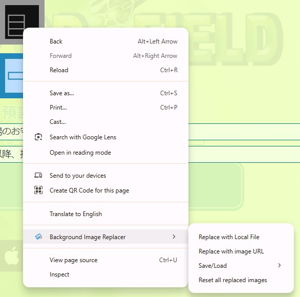

# Background Image Replacer

Chrome extension to replace the background-image properties of elements on a webpage with the users own. 

Changes are persistent even after refresh or the tab is closed.

# Table of Contents
1. [Instructions](#instructions)
2. [Features](#features)
3. [FAQ](#faq)
4. [Special Thanks](#special-thanks)

# Instructions

1. Right click an element on the webpage with a valid background-image css property.
2. Click either "Replace with Local File" or "Replace with image URL".
3. Click "OK" when the confirmation prompt appears.
4. Import your image/Enter the image URL.

# Features
* Replace background-image elements with either local images or by URL
* Persistent replaced image data through IndexedDB 
    * (Makes changes last through a refresh/closed tab)
* Save and load your replaced image data as JSON files
* Reset replaced image data

# FAQ
WIP

# Special Thanks
This is a modified version of the <a href="https://github.com/aswinkumar863/replace-image-chrome">Replace Image Locally extension by aswinkumar868.</a> The original extension is capable of changing the src of img elements.

<a href="https://www.flaticon.com/free-icons/picture" title="picture icons">Picture icons created by Pixel perfect - Flaticon</a>